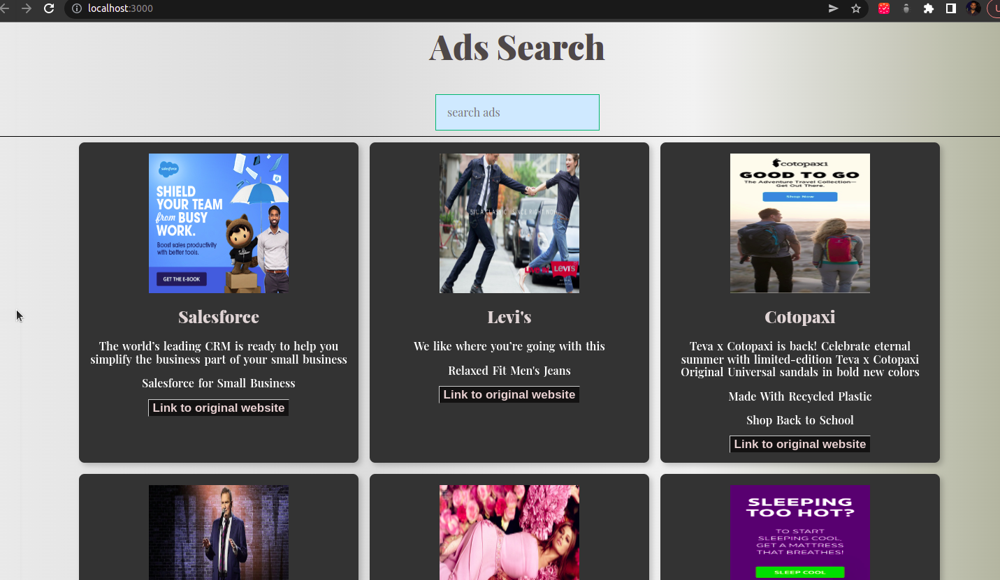
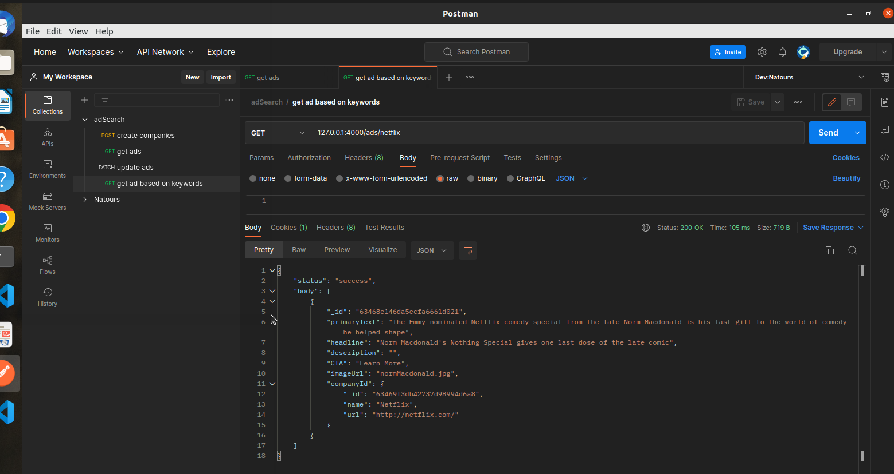

# Ad-search app

**INTRO**:  1. This is an ad search application in which there are some ads of some companies. On the basis of keywords you search and if those keywords are included in the name, primary text, headline or description of the ad, the ad will be shown.

**Technologies used**:  

1.  Frontend: ReactJS, React hooks, html, css, javascript, tachyons
2.  Backend: Nodejs, Express, MongoDB, Mongoose
3.  Testing: Postman(for testing API)

---

## This is how the application looks:

## Tested the API with POSTMAN:

---

## Watch the live demo of this project by clicking on this link: https://www.youtube.com/watch?v=Ve_jQeFDWNU

- After making this video i made some changes to the CSS of this project, you can see that in the picture of the application i posted above.

---

## <u>Timeline i went through while making this project</u>

**1st stage: Figuring out the backend/business logic:** 

**Problem statement** : show the ads based on the keywords typed.

**Steps:** 

1. Two collections in database are -> ads and companies. So they are not related. So i related the two collection by referencing them with each other with the help of `id`.
2. Modelled the data by referencing the two collection so that with the help of `population` in mongoose i can show both the collection's data in one query where one collection's data will be embedded in other's.
3. Now i had think about the solution of the main problem
4. I first started of with the thought of looping over the data and matching the string one by one: **failed**
5. Then thought how to solve this with aggregation pipeline.
6. Started solving using `$text` and `$search` mongoDB operators in `$match` stage of aggregation pipeline.
7. Did not work because it was somehow not returning anything if there were repeated words present for the searched keyword. Like if `the` was present two times and if we searched for `two` it was not returning anything.
8. Second problem was it was not checking for `name field` in `companies collection` because that was embedded in `ads collection` and that was being filled with the help of `populate function` which was not applied in `aggregation` pipeline because aggregation works directly on `Model` and model has just `id` field of company in ads collection.
9. Then thought about solving with `$regexFind` mongoDB operator: did not work because the returned results were not consistent and again the same problem, did not search for name field in companies collection which was embedded after population.
10. Thne stumbled upon `$regex` mongoDB operator. It was returning correct documents after searching for the keyword in primaryText, headline and description field in ads collection. But again did not search for the `name field`
11. Tried to include `$lookup` stage in aggregation pipeline to populate the companyId field in ads collection and then do $regex matching for the keyword: But did not work.
12. **Finally found the solution**: Used seperate aggregation pipeline for companies collection, then used `$regex` to match the keyword for name field in companies collection and with the found document, used the `id` of the document and did query on ads collection to find the document matching the `id`. And the populate function was running after every query so the whole data about the ad was hence returned

**2nd stage: Figuring out the front-end logic**

**Problem statement: Rendering the ads on front end based on search keyword:**

**Steps:** 

1. When the page will loads first time, when there are no searches, all the ads will be shown
2. Then when the user searches for keywords then the ads will be shown based on the keywords searched.
3. I have put the `limit of letters for keywords as 2`. If the keyword is equal to or less than 2 then the specific ads will not be shown, the page will remain as it was when it was first rendered and all the ads were showing.
4. for keywords searching i have used parameters in API url to send the request to backend to get the data.
5. Used `React hooks` and `event handlers` to get the search keyword, send request to API and update the state to implement the required functionality.

**This is how i completed the task**

---

## Steps to run this project in your local machine

1. Nodejs version i am using: 16.15.1
2. npm version i am using: 8.13.2
3. Clone the repository
4. go into the `ads-backend` folder in the repository and run `npm install`
5. go into the `ads-frontend` folder in the repository and run `npm install`
6. Then go in `ads-backend` folder and run `npm start` in terminal to start the backend api server, it will listen on `port 4000`
7. Then go in `ads-frontent` folder and run `npm start` in the terminal to start the react application and render the front-end part of the application. It will run on `port 3000`
8. Then search for keywords you want to search for and the respective ads will be shown
9. **Remember to include letter more than 2 to let the application show the ads**

---
